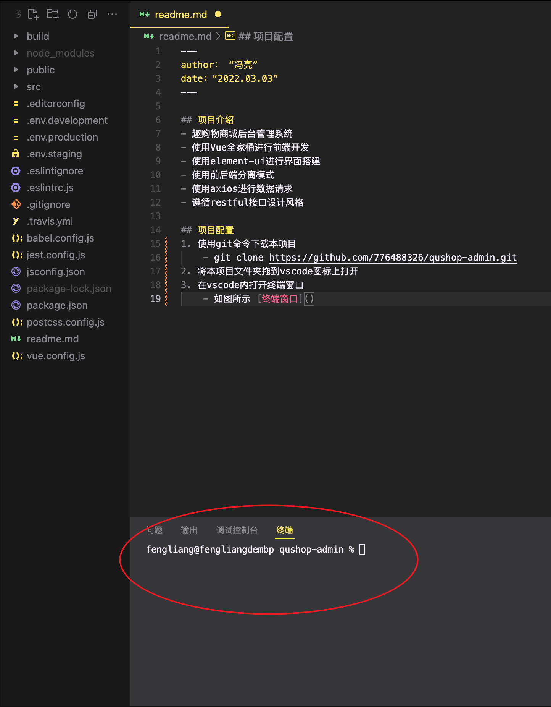

---
author： “冯亮”
date：“2022.03.03”
---

## 项目介绍
- 趣购物商城后台管理系统
- 使用Vue全家桶进行前端开发
- 使用element-ui进行界面搭建
- 使用前后端分离模式
- 使用axios进行数据请求
- 遵循restful接口设计风格

## 项目配置
1. 使用git命令下载本项目
    - git clone https://github.com/776488326/qushop-admin.git
2. 将本项目文件夹拖到vscode图标上打开
3. 在vscode内打开终端窗口
    - 如图所示 
4. 运行命令
    - npm i --save           安装项目的依赖包
    - npm run serve          启动项目

## 项目使用
- src          项目源码
- public       项目静态资源
- 其余为基本配置
- 二次开发仅需在src中进行即可

## 注意事项
- 启动前需要先将服务端启动，[服务端仓库](https://github.com/776488326/qushop-serve.git)
- 本项目需配合服务端来进行交互，将服务端仓库也下载到本地并启动
- 下载和启动方式同上边的项目配置过程
- 所有的数据均为真实数据，需要对数据库进行读写
- 使用mongdb作为数据库，[安装参考](https://www.runoob.com/mongodb/mongodb-window-install.html)
- 安装完成后，在cmd中，使用mongod来启动数据库服务器
- 将服务端的datebase中的数据库文件导入mongodb中
- cmd命令 mongorestore -h IP --port 端口 -u 用户名 -p 密码 -d 数据库 --drop 文件存在路径
    - 
- 启动服务器代码和当前项目即可

